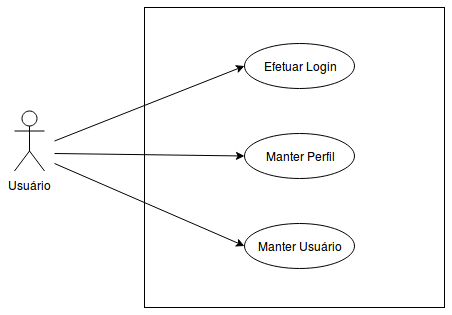
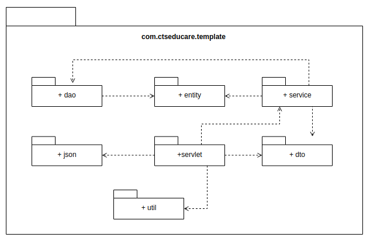
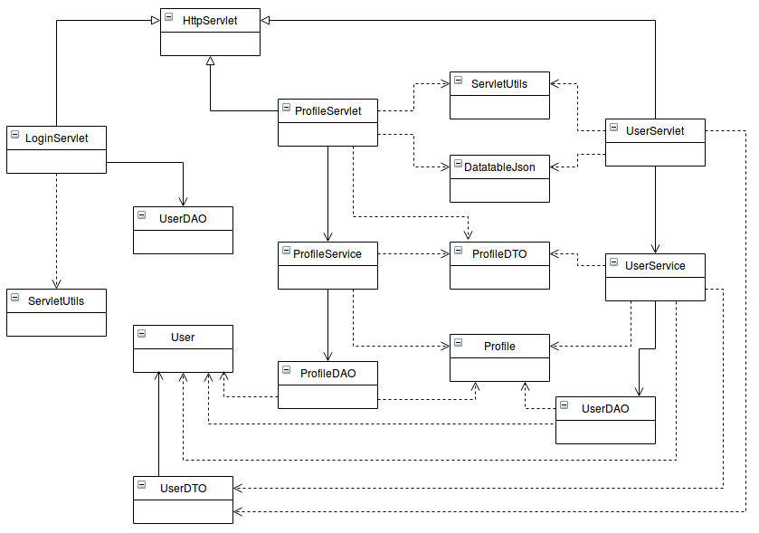
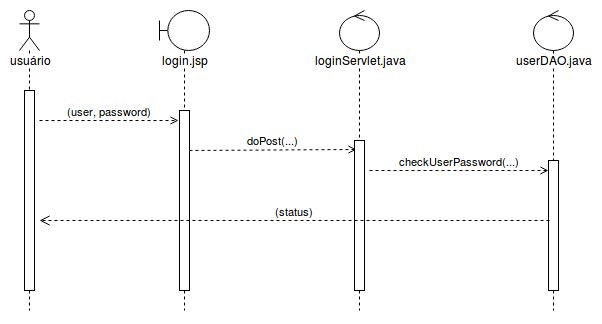
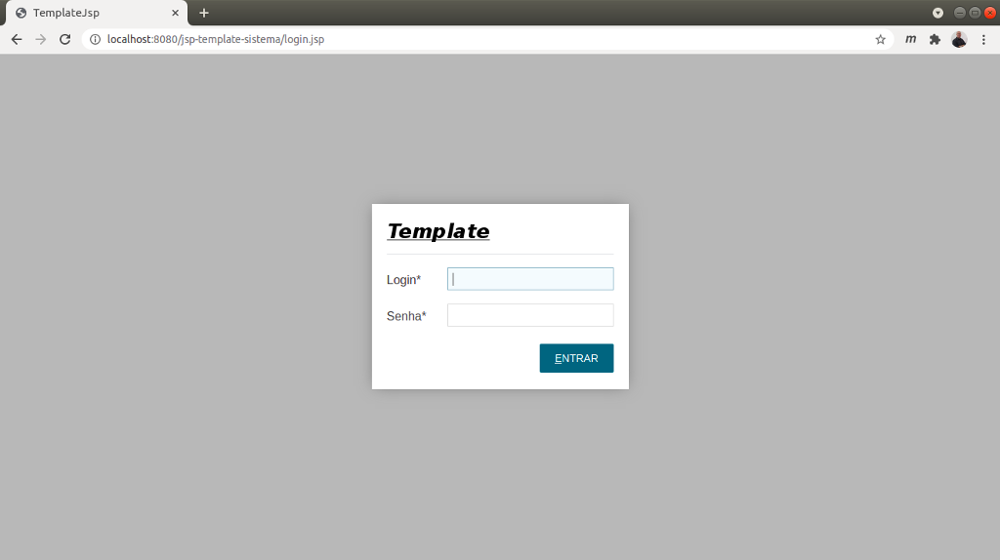
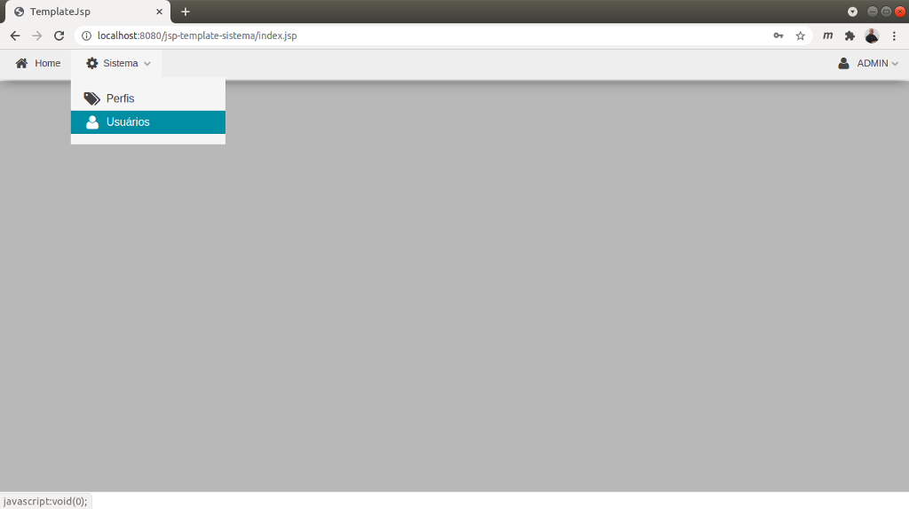
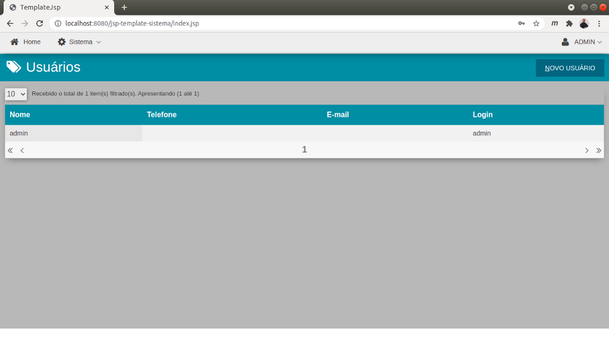
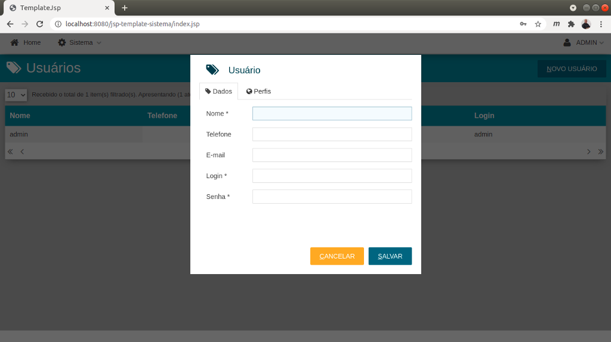
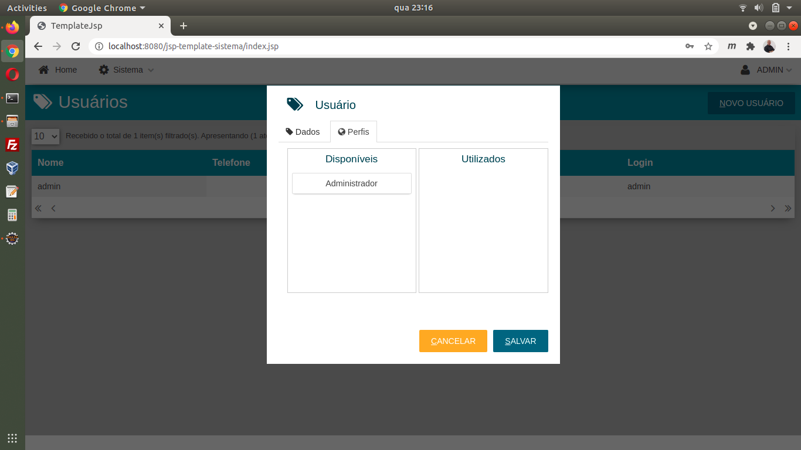

# JspTemplateSistema

## Descrição
O **JspTemplateSistema** é um projeto que disponibiliza recursos básicos de uma aplicação Web Java EE. O projeto contém tela de acesso, cadastro de perfis, cadastro de usuários, listagens e toda a camada de acesso ao banco de dados.

## Tecnologias
O projeto utiliza as seguintes tecnologias:

* Java 11
* Apache Tomcat
* Apache Mave
* MySQL Server
* Hibernate ORM
* IDE Eclipse

## Documentação

### Caso de uso

### Diagrama de pacotes

### Diagrama de classes

### Diagrama de sequência - Acesso ao sistema

## Screenshots

### Login

### Tela principal

### Listagem de usuários

### Edição de usuários

## Histórico de lançamentos

* 1.0.0 (2021-05-05)
    * Primeira versão
